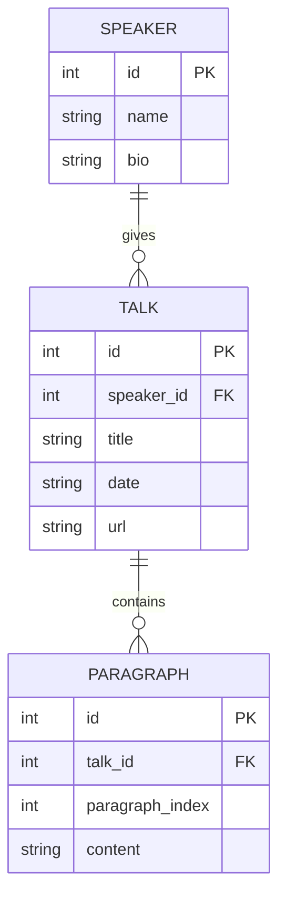
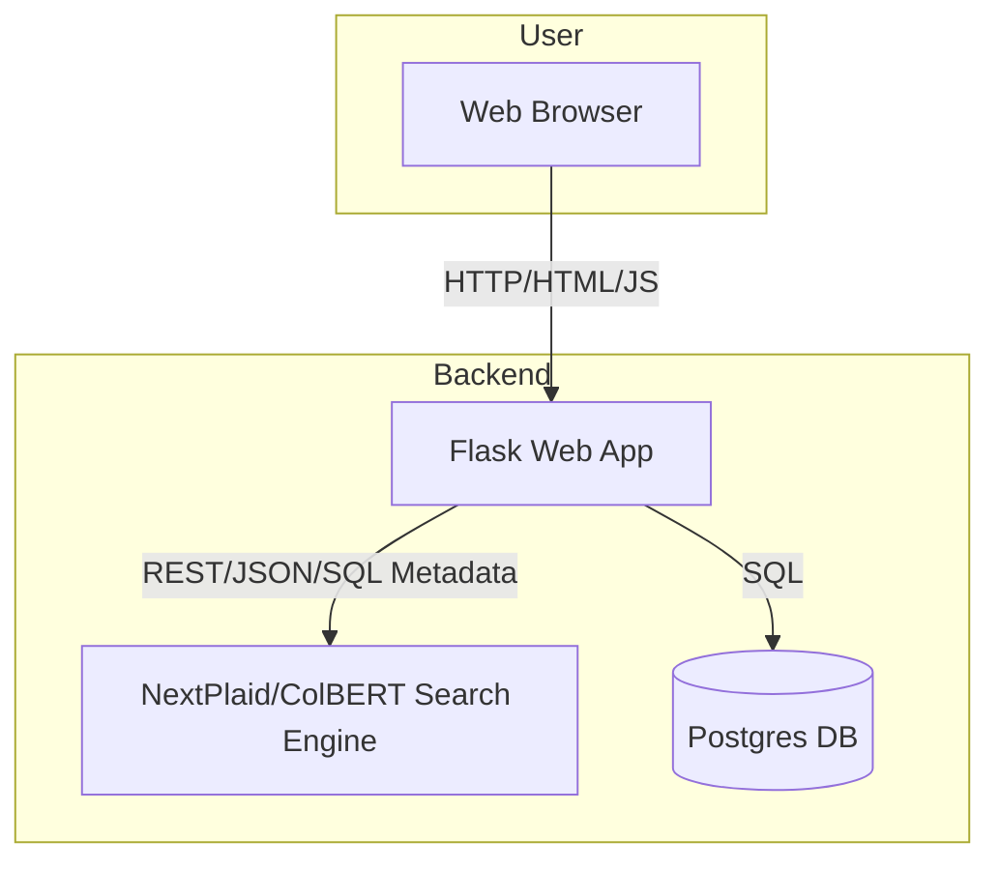

# BYU Speeches - Semantic Search

A semantic search engine for [BYU Speeches](https://speeches.byu.edu) that scrapes speech transcripts, indexes them at the paragraph level using [ColBERT](https://github.com/lightonai/next-plaid) (via the `lightonai/GTE-ModernColBERT-v1` model), and provides both a CLI and web interface for finding relevant content by meaning rather than just keywords.

Due to copyright, you must run this on your own machine and download the speeches yourself using the included scraper.

## Demo


## Architecture

### Entity Relationship Diagram



### System Design



## What I Learned

- **ColBERT and late-interaction retrieval** — ColBERT computes token-level embeddings for both queries and documents, then uses a "late interaction" MaxSim operator to score relevance. This gives much richer semantic matching than single-vector models while remaining efficient enough for large-scale search.
- **Connecting semantic search to meaningful context** — Indexing at the paragraph level and carrying structured metadata (speaker, title, date, URL) through the search pipeline makes raw similarity scores actionable. Matching a paragraph is only useful when you can link it back to the full speech and present it in context.
- **Integrating AI models into a practical application** — Wiring a transformer-based model into a real system involves more than just calling an API: batching documents, handling retries, managing index lifecycle, and designing a UI that surfaces results effectively all required careful design.

## AI Integration

This project is built around AI-powered semantic search. The core search engine uses **ColBERT** (specifically the `lightonai/GTE-ModernColBERT-v1` model) running via the [NextPlaid](https://github.com/lightonai/next-plaid) server. Every paragraph from every scraped speech is embedded into token-level vectors and stored in a ColBERT index. At query time, the user's natural-language question is also embedded, and the system finds the most semantically similar paragraphs using ColBERT's MaxSim late-interaction scoring — meaning it understands meaning, not just keyword overlap.

## How I Used AI to Build This Project

I used Claude Opus 4.6 with GitHub Copilot to build most of the implementation — the scraping pipeline, database layer, indexing logic, search interface, and web frontend. I designed the overall architecture and implementation approach myself, then leveraged AI assistance for writing and iterating on the code.

## Why This Project Is Interesting

BYU Speeches has thousands of talks spanning decades, but finding content on a specific topic can be difficult with traditional keyword search. This project provides real value by enabling semantic search — you can describe what you're looking for in natural language and get back the most relevant paragraphs, even if they don't contain the exact words you used. It turns a large archive into something genuinely explorable.

## Sharing

You are welcome to use this project as an example for future semesters.

## Prerequisites

- Python 3.14+
- [uv](https://docs.astral.sh/uv/) (for dependency management)
- [Docker](https://www.docker.com/) and Docker Compose
- A [Hugging Face](https://huggingface.co/) account and access token (optional)

## Setup

### 1. Start services

The project uses Docker Compose to run PostgreSQL (for storing speeches) and NextPlaid (the ColBERT-based search engine).

```bash
export HF_TOKEN=<your-huggingface-token>
docker compose up -d
```

This starts:
- **PostgreSQL** on port `5432` — stores speakers, talks, and paragraph content
- **NextPlaid** on port `8080` — handles semantic indexing and search using the `lightonai/GTE-ModernColBERT-v1` model

### 2. Install dependencies

```bash
uv sync
```

## Usage

All commands are run through the `speeches-search` CLI entry point.

### Scrape speeches

Download all speaker pages and their speech transcripts from speeches.byu.edu into the database:

```bash
uv run speeches-search --scrape
```

This creates the database tables (if they don't already exist), scrapes every speaker and their talks, and stores the text content paragraph-by-paragraph. Already-downloaded talks are skipped on subsequent runs.

### Index speeches

Build the semantic search index from the scraped data:

```bash
uv run speeches-search --index
```

This reads all speakers and talks from the database and indexes each paragraph into NextPlaid. Already-indexed paragraphs are skipped automatically.

### Search speeches (CLI)

Run an interactive search in the terminal:

```bash
uv run speeches-search --search
```

You will be prompted to enter a query and optionally filter by speaker name. Results show matching talks with relevance scores and URLs.

### Search speeches (Web UI)

Start the Flask web interface:

```bash
uv run speeches-search --webapp
```

Then open <http://localhost:8081> in your browser. The web UI supports:
- Free-text semantic search
- Filtering by speaker
- Configurable number of results
- Inline paragraph previews with context

### Reset everything

Drop all database tables and delete the search index:

```bash
uv run speeches-search --drop
```
