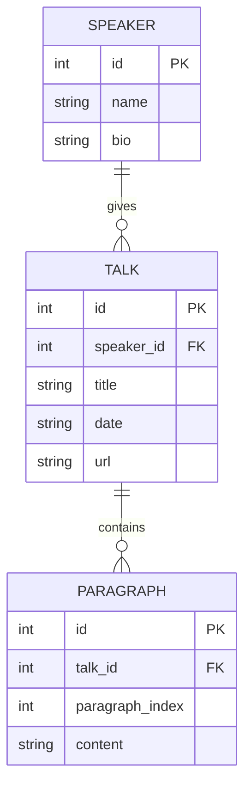
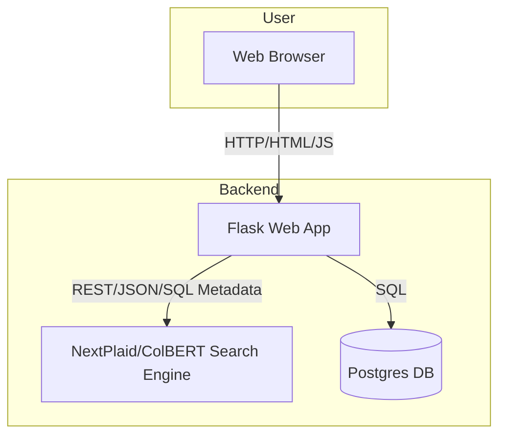

# BYU Speeches Search — Design Document

## Project Summary

**Purpose:**

- Provide a fast, modern, and user-friendly search engine for BYU devotional speeches.
- Allow users to search for relevant paragraphs, filter by speaker(s), and explore speeches interactively.
- Support advanced features like dark mode, infinite scroll, and multi-speaker filtering.

**Goals:**

- Make it easy to find inspirational and relevant content from BYU speeches.
- Enable deep search (semantic, not just keyword) and paragraph-level results.
- Provide a clean, modern, and accessible web interface.

## Initial ERD (Entity Relationship Diagram)

---

## System Design Diagram

---

## Initial Daily Goals

Spend 2-3 hours working on project.
